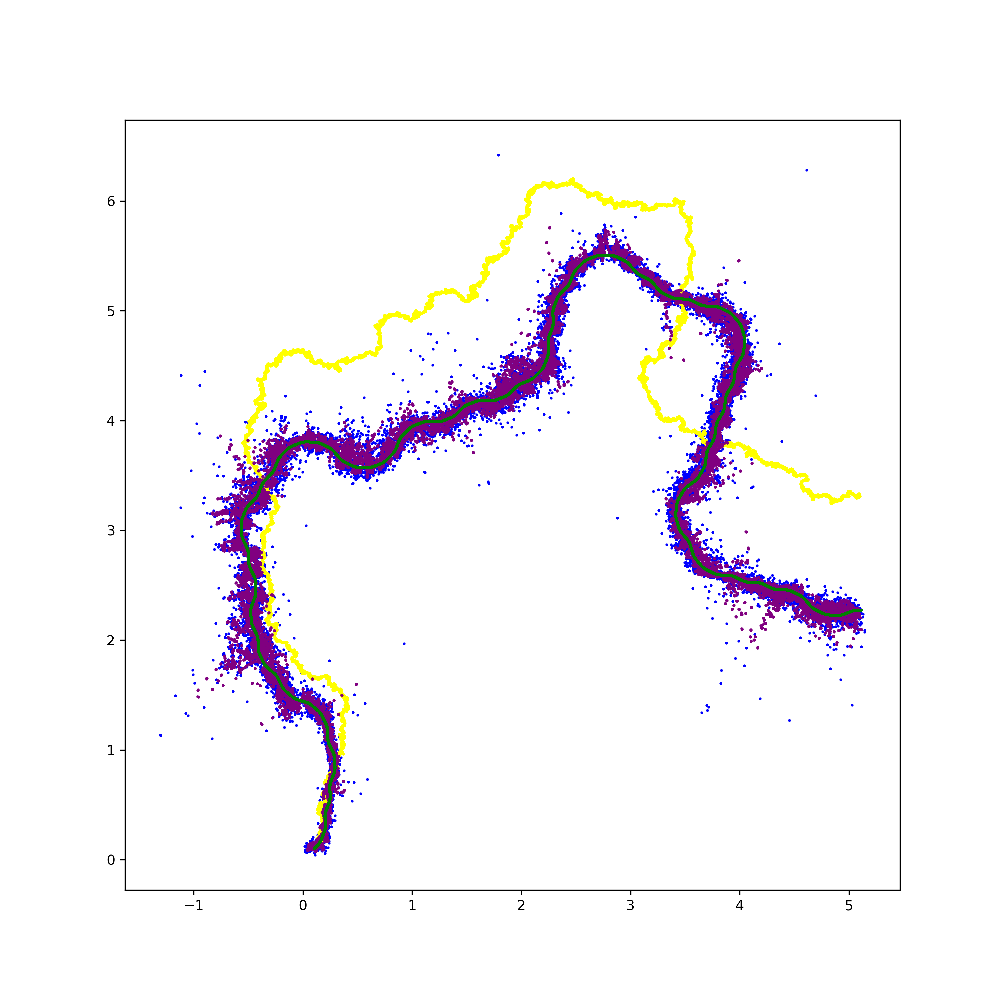
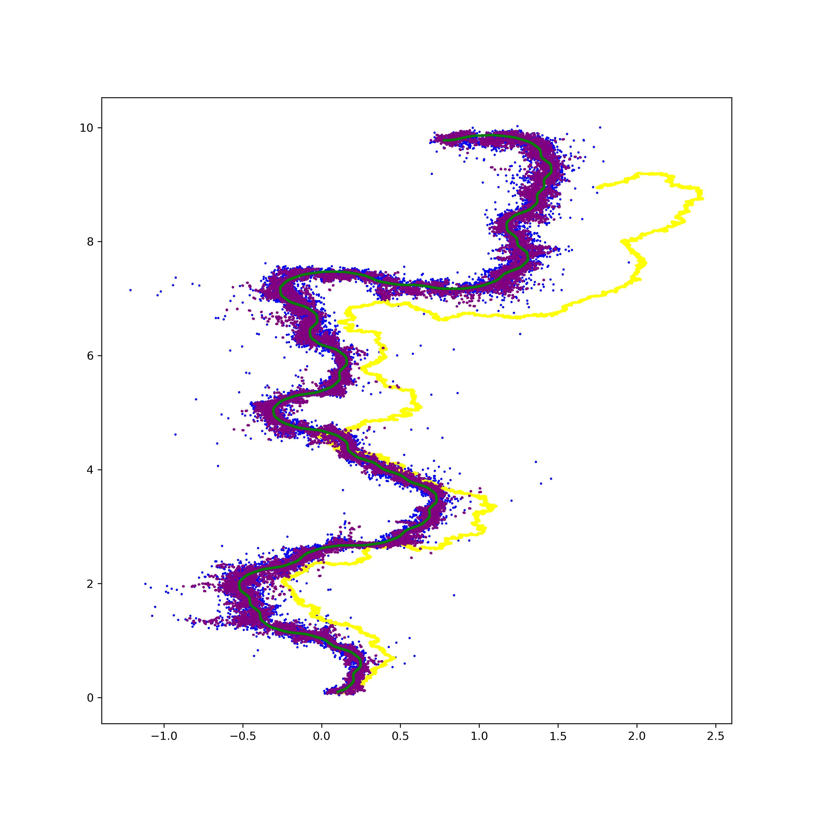
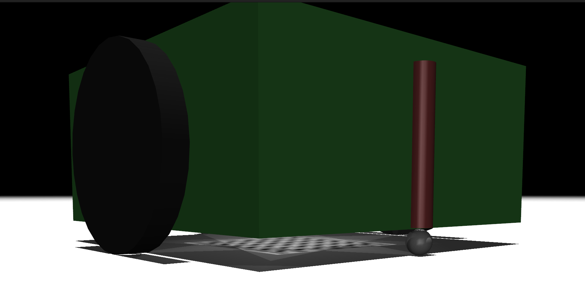
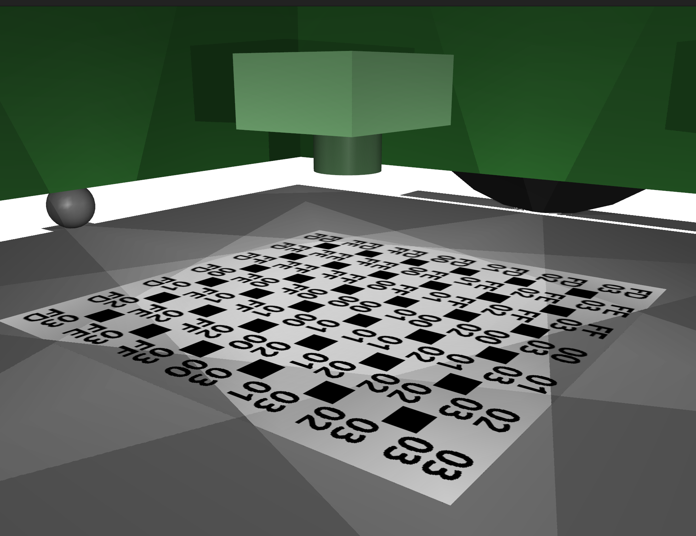
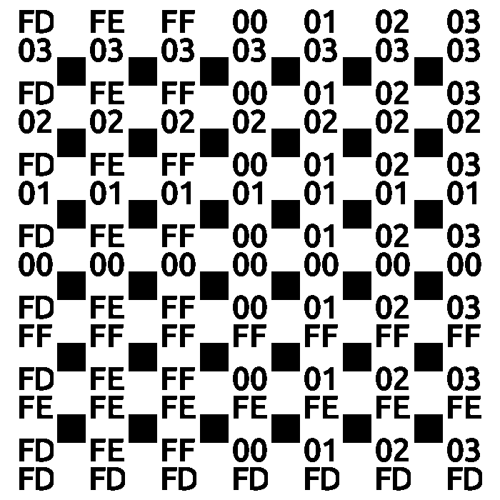

# Sensor Fusion for Mobile Robot Localization

This project demonstrates a robust localization system for a mobile robot by fusing high-frequency Inertial Measurement Unit (IMU) data with low-frequency, high-accuracy vision-based position estimates using a Kalman filter.

Green: ground truth; Yellow: IMU only; Purple: sensor fusion
|              |            |
| ------------------------- | -------------------- |
|  |  |


## Project Overview

The primary challenge in mobile robot navigation is accurately determining the robot's pose (position and orientation) in real-time. This project tackles this by addressing the core limitations of common sensors:

1.  **IMU for Motion Tracking:** An IMU provides high-frequency motion updates (acceleration and angular velocity). While this allows for continuous position estimation through integration (dead reckoning), it inevitably suffers from accumulating sensor noise and bias, causing the position estimate to drift significantly over time.

2.  **Vision for Drift Correction:** To counteract this drift, a vision system provides absolute position measurements. This system uses OpenCV to detect markers on a grid map and a Bidirectional LSTM to infer the robot's precise position from those markers.

3.  **Kalman Filter for Optimal Fusion:** A Kalman filter is implemented to optimally fuse the IMU and vision data. It leverages the high-frequency updates from the IMU for smooth, continuous tracking while using the accurate but less frequent vision estimates to correct for drift. The result is a state estimate that is more accurate and reliable than what could be achieved with either sensor alone.

## System Components

* **Mobile Car:** A simulated robotic platform defined in `car.xml` and run in the MuJoCo physics engine.
* **Inertial Measurement Unit (IMU):** Provides acceleration and angular velocity readings to the motion model.
* **Camera:** A downward-facing camera on the car that captures images of the ground map.
* **Localization Map:** A dynamic grid map generated by `mapGenerater.py`. Each cell on the grid is marked with its world coordinates, represented as hexadecimal numbers, which the vision system uses as a reference.
* **Vision Pipeline:** A two-stage system for inferring pose from an image:
    * **OpenCV:** Used for low-level feature extraction to detect and identify markers.
    * **Bidirectional LSTM Model:** A PyTorch model (`Tag2Location`) that performs high-level spatial reasoning on the sequence of detected markers to estimate a pose.
* **Simulation Environment:** [MuJoCo](https://mujoco.org/) is used for all simulations, including generating the training data and testing the final system.

| **Component**             | **Image**                                   |
| ------------------------- | ------------------------------------------- |
| Simulated Car with Camera |  |
| Camera View of Map        |  |
| Localization Grid Detail  |  |

## How to Run

### Environment Setup

The required Python dependencies can be found in `requirements.txt`. This project was validated on **Ubuntu 22.04**.

The main dependencies are:
* `opencv-python`
* `pytorch`
* `mujoco`

### 1. Generate Training Data

Run the `get_train_data.py` script to generate the training dataset. This script uses MuJoCo to create millions of labeled image-pose pairs.

```bash
python get_train_data.py
```

This will create `data_1e6_s.hdf5`, which is approximately 90 GB.

### 2. Train the Vision Model

Run the `train.py` script to train the `Tag2Location` model on the generated dataset.

```bash
python train.py
```

The trained model weights will be saved in the `bilstm/` directory.

### 3. Test and Verify the System

First, run `get_R.py` to empirically calculate the model's error covariance matrix `R`, which is crucial for tuning the Kalman filter.

```bash
python get_R.py
```

Then, run `test.py` to execute the full simulation, fusing the IMU and vision data with the Kalman filter and plotting the results.

```bash
python test.py
```

## Technical Methodology

The system works in two main stages: training a vision model and then using it within a Kalman filter for real-time fusion.

### 1. Vision-Based Localization (OpenCV + LSTM)

Instead of using a raw CNN, we employ a two-step process:

  * **Feature Extraction (`map2tag`):** OpenCV's `findContours` and `matchShapes` functions are used to detect all visible markers in a camera image. This produces a variable-length sequence of recognized tags, where each tag includes its ID (0-F or a grid marker), a confidence score, and its pixel coordinates.
  * **Position Inference (`Tag2Location`):** A Bidirectional LSTM processes this sequence of tags. By analyzing the spatial arrangement of all visible tags simultaneously (both forwards and backwards through the sequence), it learns the complex geometric relationships that define the robot's overall `(x, y, angle)` pose. To handle the variable number of tags efficiently during training, the script uses `torch.nn.utils.rnn.pack_sequence`.

### 2. Kalman Filter Tuning and Fusion

The filter's performance depends on accurately modeling sensor noise.

  * **Measurement Noise `R`:** This matrix, which quantifies the vision system's uncertainty, is calculated empirically by `get_R.py`. The script runs the trained model on a test set and computes the actual covariance of the prediction error.
  * **Process Noise `Q`:** This matrix models the IMU's uncertainty. It's defined as a base uncertainty that is scaled by the car's current velocity, correctly reflecting that the motion model becomes less certain at higher speeds.
  * **Real-Time Fusion:** The `test.py` script runs the main loop:
      * **Prediction (120Hz):** The Kalman filter predicts the next state using IMU velocity readings.
      * **Correction (30Hz):** The vision pipeline provides a measurement. A crucial **pose unwrapping** step corrects for the periodic nature of the map coordinates, preventing large, erroneous jumps in the estimate. This corrected measurement is then used to update the filter's state and cancel out the IMU's accumulated drift.
